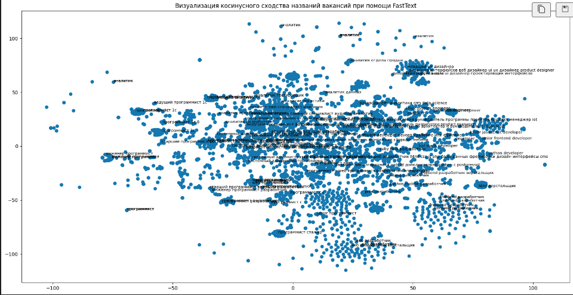
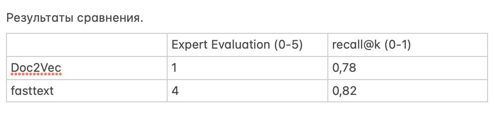

# DeepLearningPartTwo
Цель проекта: разработка и реализация программного решения для сопоставления текстовых описаний вакансии и резюме.

### Что мы сделали 
По результатам работы было разработано решение, способное сопоставлять пользователей и резюме.
Датасет с пользователями и резюме были взяты с hh.ru при помощи самоcтоятельных средств парсинга. Парсер доступен по пути 
`
./ipnbs/get_vac_info.ipynb
`.

В основе решения лежит алгоритм sentence-transformer, детальнее с реализацией можно ознакомиться по пути 
`
./ipnbs/nlp_case-2.ipynb
`

Общий вид решение имеет следующий

Для тестирования представлены 9923 пользователей, в целях демонстрации мы предоставляем возможность отобразить рекомендации по 9923 пользователям. На одного пользователя выводится по 3 рекомендованных вакансии. В решении был использован интуитивно-понятный, простой и прогрессивный интерфейс.

### Проведено сравнение разных моделей и Был произведен подбор гиперпараметров

Были произведены сравнения моделей с гимерпараметрами
 - Модель Doc2Vec: vector_size=300, window=3, min_count=1, workers=4, epochs=20
 - Модель Doc2Vec: vector_size=500, window=5, min_count=3, workers=4, epochs=20
 - Модель Doc2Vec: vvector_size=1000, window=5, min_count=3, workers=4, epochs=20

Опытным путем был произведен подбор оптимальных гипермараметров для моделей типа Doc2Vec.

Также была использована модель fasttext с гиперпараметрами 
 - model='skipgram', wordNgrams=3, dim=300, ws=3, minCount=1, epoch=20, thread=4, verbose=2

Было выяснено, что модель fasttext работает хорошо, даже лучше Doc2Vec
С блокнотом можно ознакомиться по пути `./ipnbs/nlp_case_2_v2.ipynb`

При помощи FastText также ыбла произведена визуализация косинусного сходства названий вакансий

### Произведена оценка производительности модели

Железо для тестов Google colab:
 - CPU Intel Core i6
 - GPU NVidia Tesla T4

Инференс метчинга всего датасета вакансий по резюме(9924 вакансии) с fasttext занимает ~41минуты --> ~0,61сек на запись. 

Запрос на метчинг в интерфейсе streamlit, занимает 0.000003ms

### Выбраны и обоснованы ml метрики 

Различные подходы к решению были сравнены между собой с помощью метрик:
- «Expert Evaluation» тк в данной задаче может отсутствовало точное правильное решение, который можно использовать для оценки качества автоматических алгоритмов. 
- «recall@k при k=3». С помощью экспертов оценки был получен эталонный тестовый дотаяет по которому считалась данная метрика. Обусловленной выбора данной метрики связана с решением задачи ранжировани. 

Ниже представлена таблица метрик для обоих моделей

### Как запустить
Все зависимости были зафиксированны в requirements.txt. Необходимо склонировать репозиторий, восстановить зависимости, находясь в корне склонированного репозитория прописать 
`
$ streamlit run main.py
`
что приведет к запуску приложения в отдеьной странце браузера.
Если же запуска не произошло по какой-то из причин, рекомендуется отдельно прописать 
`
$ pip install streamlit 
`
и повторить первую команду

### Почему решение является обоснованным
 - Для работы сервиса используется структура словаря переведенная в датафрейм, что позволяет выдавать рекомендации за константное время равное О(1), что обеспечивает высокую производительность
 - Предлагаемое решение отвечает требованиям качества в терминах удобства использования и легковесности, легкости сопровождения и масштабирования
 - Мастабирование возможно за счет гибкой структуры вывода данных, так как это словарь, возможно заменить его на словарь с наилучшими рекомендациями, которые могут подгружаться автоматически и ежедневно при помощи workflow типа jenkins и п.р, сами же рекомендации могут быть сгенерированны любым способом, который предоставляет наибольшую их релевантность

 #### Некоторые дополнительные разъяснения
Файл по пути `./ipnbs/DeepLearningParseData.ipynb` показывает как загружались данные по вакасиям с сайта трудвсем (в последующем данные не использовались).
Файл по пути `./ipnbs/DeepLearnForStreamlit.ipynb` показывает как создавался словарь ид пользователя -> рекомендации.